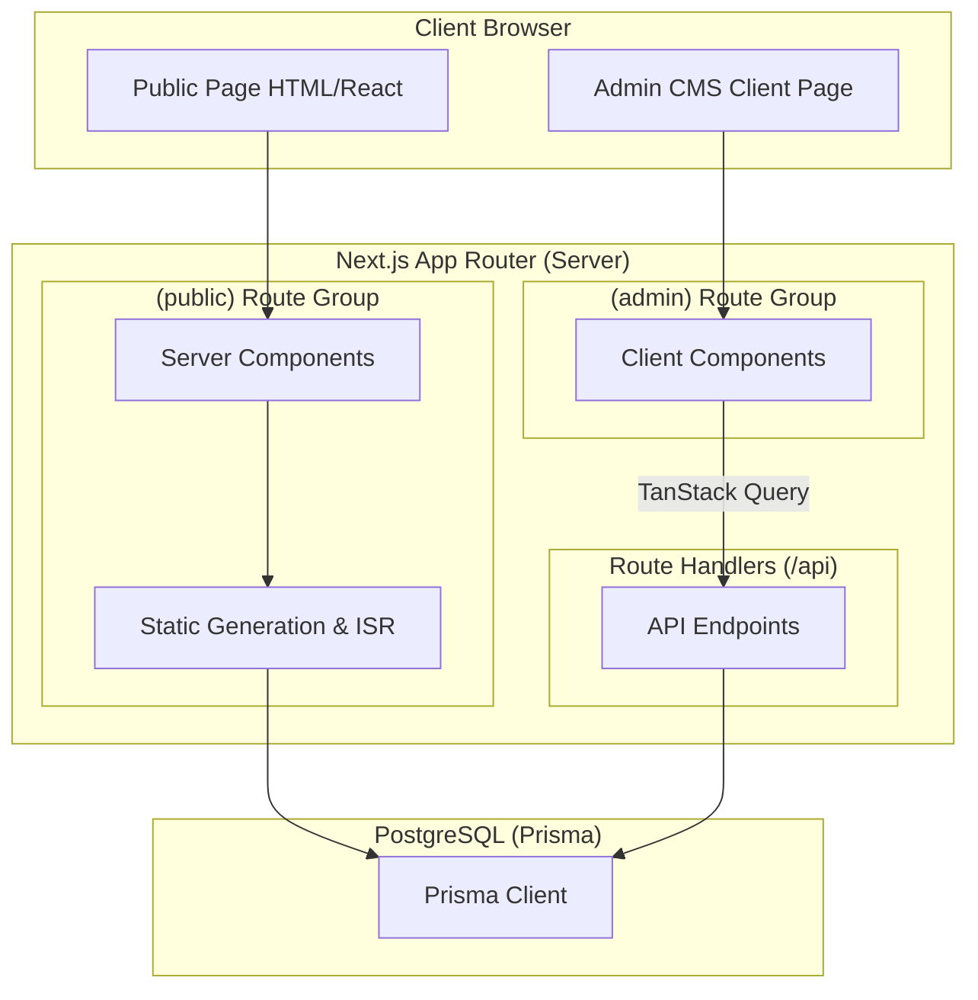

# News CMS System Architecture Document

This document provides a comprehensive overview of the system architecture, design decisions, data flow patterns, security specifications, and operational guidelines for the News Website and CMS, based on the project's authoritative documentation under the `docs` folder and `AGENTS.md`.

---

## 1. Product Target & Design Strategy

The project aims to deliver a production-ready publishing platform characterized by:
*   **Fast, Search-Optimized Public Reads:** Delivering high-speed, SEO-hardened pages (e.g., articles, category listings) with dynamic and static metadata.
*   **Secure & Interactive Editorial Workspace (CMS):** A robust dashboard for creators to write, categorize, tag, and publish articles, manage static pages, upload assets, and customize site navigation.
*   **Production Reliability:** Designed for a PostgreSQL database, S3-compatible object storage, robust caching/CDN revalidation strategies, comprehensive test suites, and strict access controls.

---

## 2. Directory & Structural Architecture

The codebase adheres strictly to **Vertical Slice Architecture (VSA)** to ensure business logic is modularized and organized by business domain rather than technical function.

### Directory Structure

```text
news-cms/
├── app/                       # Next.js App Router Pages and Layouts
│   ├── (public)/              # Route Group for public reader-facing pages
│   ├── (admin)/               # Route Group for administrative/editorial screens
│   └── api/                   # Route Handlers for admin CRUD, auth, and webhooks
├── features/                  # Domain-specific business logic (colocated by slice)
│   ├── articles/              # Components, hooks, services, types, and schemas for articles
│   ├── categories/            # Category taxonomy slice
│   ├── tags/                  # Tag taxonomy slice
│   ├── media/                 # File upload and asset library management
│   ├── auth/                  # Authentication logic and services
│   ├── users/                 # Admin user directory management
│   ├── navigation/            # Custom site header menus
│   ├── settings/              # Site global configuration (logos, metadata defaults)
│   └── public-content/        # Public-facing data fetching and view layout logic
├── components/
│   └── ui/                    # Reusable, business-agnostic UI primitives (e.g., shadcn/ui)
├── lib/                       # Shared utilities, client initializations (Prisma, Auth)
│   ├── db.ts                  # Shared Prisma client instance
│   ├── auth/                  # Shared auth wrappers/utilities
│   ├── validation/            # Common Zod validation rules
│   └── cache/                 # Caching and invalidation utilities
└── prisma/                    # Schema definition and database migration scripts
```

---

## 3. Hybrid Next.js Rendering & Component Paradigm

The application uses a **hybrid model** optimized separately for public-facing search visibility and admin-facing rich interactivity.



### 3.1 Public Website (Server-Side Performance)
All reader-facing pages are built as **React Server Components (RSC)** with static/incremental revalidation to optimize Core Web Vitals and crawlability.
*   **Key Routes:** `/`, `/news/[slug]`, `/category/[slug]`, `/tag/[slug]`, `/search`, static pages (`/about`, etc.), `/sitemap.xml`, and `/robots.txt`.
*   **Data Retrieval:** Fetched directly from server-side services or cached database queries using Prisma. Under no circumstances are public page reads forced through internal REST round-trips (unless an external client API is required).
*   **SEO:** Leverages Next.js Metadata API from Server Components (`generateMetadata`) to export Og/Twitter cards, canonical URLs, and responsive image alt tags.

### 3.2 Admin CMS (Client-Side Interactivity)
All editor and manager screens are built using **Client Components** (`"use client"`) to support complex, interactive form workflows.
*   **Key Routes:** `/admin/login`, `/admin/dashboard`, `/admin/articles`, `/admin/articles/create`, `/admin/articles/[id]/edit`, and configuration lists (categories, tags, media, settings, navigation, users).
*   **Data Retrieval & Mutation:** Handled by **TanStack Query** calling `/api/admin/*` Route Handlers. Plain `useEffect` data-fetching is prohibited for routine operations.
*   **Optimization:** Heavy client-side modules (e.g., rich text editors, graphing libraries, media select modals) are dynamically imported (`next/dynamic`) to keep initial bundles light.

---

## 4. Data Flow Patterns & API Standards

### 4.1 Data Query Flow
*   **Public Read Flow:**
    1. Server Component receives route parameters (e.g., `slug`).
    2. Server-side service validates parameters.
    3. Prisma executes query filtering only for published, non-archived, and active content.
    4. React `cache()` is utilized to deduplicate queries between `generateMetadata` and component rendering.
    5. Next.js generates static HTML or serves from cached Incremental Static Regeneration (ISR).
*   **Admin Read Flow:**
    1. Admin component mounts and triggers TanStack Query hook.
    2. Hook invokes a feature-level HTTP client calling `/api/admin/...`.
    3. Route Handler intercepts the request, validates the session/role (JWT/Session cookie), parses options (pagination, sorting, search filters), and executes the Prisma query.
    4. Data is returned in the standard envelope; TanStack Query manages client caching.

### 4.2 Mutations & API Response Standard
All JSON API Route Handlers must validate incoming requests and respond with a strict, consistent payload structure.

```typescript
// Successful API Response
type ApiSuccess<T> = {
  success: true;
  data: T;
  meta?: {
    page?: number;
    limit?: number;
    total?: number;
    totalPages?: number;
  };
};

// Failed API Response
type ApiFailure = {
  success: false;
  error: {
    code: string;
    message: string;
    fieldErrors?: Record<string, string[]>; // Validation breakdown (e.g., via Zod)
  };
};
```

#### Mutation Requirements:
1.  **Zod Parsing:** All payloads (query params or JSON body) are validated with schemas before processing.
2.  **Role Verification:** Server-side roles are strictly checked at the API handler level and in a shared DAL/service authorization boundary where database access occurs. Middleware is never treated as the only security boundary.
3.  **Conflict Prevention:** Duplicate slug requests must fail with a `409 Conflict` error.
4.  **CSRF Protection:** Cookie-authenticated admin mutations must pass explicit CSRF validation or documented Origin/Fetch Metadata checks before mutation.
5.  **Revalidation Triggers:** Successful database modifications of content must trigger on-demand Next.js path or tag revalidation (`revalidatePath`, `revalidateTag`) to propagate updates to the public site.
6.  **Audit Logs:** Critical actions (publishing, modifying settings, user invites, deletes) must write an immutable audit trail in the `AuditLog` table.

---

## 5. Production Database Schema

The database model is configured for PostgreSQL using Prisma. Key requirements for production schemas:

*   **Auditability & Soft-deletes:** Soft-deletable records use `deletedAt` timestamps. Critical entities track `createdAt`, `updatedAt`, `createdById`, and `updatedById`.
*   **Indexes:**
    *   Unique indices on all slugs (`Article`, `Category`, `Tag`, `StaticPage`).
    *   Composite indexes on `Article(status, publishedAt)` and `Article(categoryId, status, publishedAt)` to optimize public listings.
*   **Core Entities:**
    *   `AdminUser`: Handles logins, locks (`failedLoginCount`, `lockedUntil`), and user statuses (`disabledAt`).
    *   `AdminInvite` & `PasswordResetToken`: Expiring, cryptographically hashed tokens for user onboarding and password recovery.
    *   `Article`, `Category`, `Tag`, `ArticleTag`: Main content and relationship tables.
    *   `Media`: Stores metadata of uploads (width, height, size, MIME type, alt text, S3 URL, storage key).
    *   `AuditLog`: Captures operations (Logins, invites, updates, publishes, settings adjustments).
    *   `StaticPage`, `NavigationMenuItem`, `WebsiteSetting`: Layout and configuration structures.

---

## 6. Security & Integrity Guardrails

### 6.1 Authentication & RBAC
*   **Auth Provider:** NextAuth.js/Auth.js or another approved production auth library utilizing secure, HTTP-only, encrypted session cookies.
*   **Password Hashing:** Stored using bcrypt or Argon2id with production-safe cost configurations.
*   **Password Policy:** Admin passwords use modern length-first rules, common-password blocking where practical, and rate limiting instead of arbitrary composition-only requirements.
*   **Role-Based Access Control (RBAC):** Supported roles include `SUPER_ADMIN` (full system ownership, user creation, settings config) and `EDITOR` (content creation, categorizing, tagging).
*   **Account Locking:** Automated login rate-limiting and lockout constraints after consecutive failed authentication attempts.
*   **MFA:** `SUPER_ADMIN` accounts require MFA before production launch, with MFA enrollment supported for all administrators.
*   **Session Controls:** Inactivity timeout, absolute session lifetime, disabled-user revocation, and re-authentication for sensitive actions are documented and tested.
*   **Authorization Boundary:** Middleware protects navigation and redirects, while Route Handlers and DAL/service helpers enforce the true authorization boundary.
*   **Security Headers:** Production responses configure CSP, HSTS, clickjacking protection, `X-Content-Type-Options`, Referrer-Policy, and Permissions-Policy.

### 6.2 Content Safety (XSS Prevention)
*   **TipTap Integration:** Content is saved preferably in structured JSON formats or parsed HTML.
*   **Server Sanitization:** Generated HTML is run through a rigorous sanitizer on the server before public rendering. Unsafe attributes (e.g., `javascript:` URLs, `onload`/`onerror` handlers, unapproved iframe providers) are stripped.
*   **External Links:** Automatically appends `rel="noopener noreferrer"` and `target="_blank"` on outward links.

### 6.3 Media Security
*   **Storage Target:** S3-compatible Object Storage (e.g., AWS S3, Cloudflare R2) in production; local file system is restricted to the development environment.
*   **Upload Flow:** Production uploads prefer presigned direct-to-object-storage URLs after server-side validation, with completion confirmation before database persistence.
*   **Upload Validation:** Explicit validation of MIME type, file signatures, and file extensions (JPG, JPEG, PNG, WebP) combined with file size checks.
*   **Storage Keys:** Trusted storage keys are generated server-side; original filenames are sanitized and never used directly as paths.
*   **Metadata & Scanning:** Sensitive image metadata is stripped or normalized where practical, and malware/object scanning is enabled where supported by the production storage stack.
*   **Asset References:** A delete operation on media is blocked if it is actively linked inside a published `Article`'s content or featured image property.

---

## 7. Performance & Caching Strategy

The system is engineered to meet Core Web Vitals requirements (Targeting Lighthouse Scores: **Performance >= 90**, **SEO >= 95**):

*   **Core Web Vitals Optimizations:**
    *   **Images:** Rendered via Next.js `<Image />` component with custom dimensions, format conversions (WebP), and alt tags parsed directly from S3 media metadata.
    *   **Fonts:** Loaded using `next/font` for local caching and Layout Shift (CLS) reduction.
*   **On-Demand ISR Revalidation:**
    *   Homepage, article pages, and listings are statically generated.
    *   When an editor changes the status of an article (published, draft, archived) or updates navigation menus, the CMS triggers revalidation tags/paths. This keeps page loads sub-second while ensuring updates are reflected almost instantly.
*   **Database Search:**
    *   Search operations query only published articles.
    *   Powered by PostgreSQL full-text search indexing, matching against article titles, summaries, and HTML bodies, sorting by relevancy score and `publishedAt desc`.

---

## 8. Test Strategy & Observability

Verification of functionality occurs at multiple integration levels:

```text
┌────────────────────────────────────────────────────────────────────────┐
│                          Playwright E2E Tests                          │
│     (Critical journeys: login lockout, create/publish, media flow)     │
└───────────────────────────────────┬────────────────────────────────────┘
                                    │
┌───────────────────────────────────▼────────────────────────────────────┐
│                    API Route Handler Tests (Vitest)                    │
│        (Checks status codes, authentication, schema validation)        │
└───────────────────────────────────┬────────────────────────────────────┘
                                    │
┌───────────────────────────────────▼────────────────────────────────────┐
│                        Unit & Component Tests                          │
│      (Form state validations, slug utilities, permission checks)       │
└────────────────────────────────────────────────────────────────────────┘
```

*   **API Testing Pattern:** API endpoints are tested under `test/api/` using Vitest, where Prisma and Session handlers are mocked at the module boundary to verify input/output contracts.
*   **Operations & Monitoring:**
    *   **Error Boundaries:** Professional error fallback interfaces are configured for both `(public)` and `(admin)` route groups.
    *   **Structured Logging:** Standard logging patterns capture server errors and log details of administrative modifications.
    *   **Health Probe:** `/api/health` monitors service availability for containerized or serverless hosting platforms.
